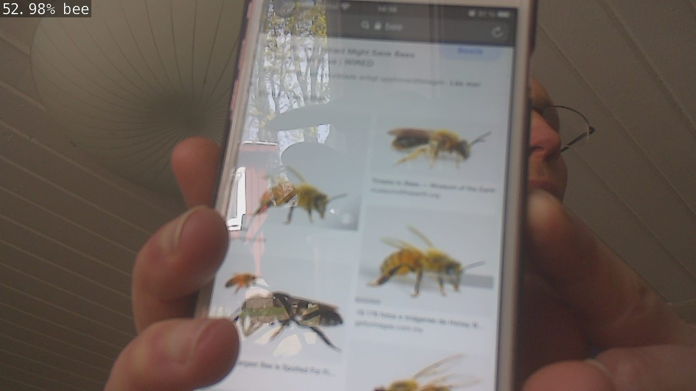

# PyTorch-Training-Resnet50

## Training and export to ONNX model

## Related links

https://pytorch.org/tutorials/beginner/transfer_learning_tutorial.html

## Test result

Then close the two test windows to export to ONNX model

## Run on Jetson Nano

... to be continue .. not finnish yet

    imagenet2.cpp 
    
Will collect image if class 1 > thresshold probablility and store on external USB hard drive ..

### Start Docker container comand 

    jetson@jetson-desktop:~/jetson-inference$ docker/run.sh --volume /:/olle_test1

    root@jetson-desktop:/olle_test1/home/jetson/jetson-inference/examples/my-recognition# cmake CMakeLists.txt  
    -- The C compiler identification is GNU 7.5.0   
    -- The CXX compiler identification is GNU 7.5.0
    -- Check for working C compiler: /usr/bin/cc
    -- Check for working C compiler: /usr/bin/cc -- works
    -- Detecting C compiler ABI info
    -- Detecting C compiler ABI info - done
    -- Detecting C compile features
    -- Detecting C compile features - done
    -- Check for working CXX compiler: /usr/bin/c++
    -- Check for working CXX compiler: /usr/bin/c++ -- works
    -- Detecting CXX compiler ABI info
    -- Detecting CXX compiler ABI info - done
    -- Detecting CXX compile features
    -- Detecting CXX compile features - done
    -- Looking for pthread.h
    -- Looking for pthread.h - found
    -- Looking for pthread_create
    -- Looking for pthread_create - not found
    -- Looking for pthread_create in pthreads
    -- Looking for pthread_create in pthreads - not found
    -- Looking for pthread_create in pthread
    -- Looking for pthread_create in pthread - found
    -- Found Threads: TRUE  
    -- Found CUDA: /usr/local/cuda (found version "10.2") 
    -- Configuring done
    -- Generating done
    -- Build files have been written to: /olle_test1/home/jetson/jetson-inference/examples/my-recognition
    root@jetson-desktop:/olle_test1/home/jetson/jetson-inference/examples/my-recognition# make
    Scanning dependencies of target imagenet2
    [ 50%] Building CXX object CMakeFiles/imagenet2.dir/imagenet2.cpp.o
    [100%] Linking CXX executable imagenet2
    [100%] Built target imagenet2
    root@jetson-desktop:/olle_test1/home/jetson/jetson-inference/examples/my-recognition# 

### Run program (first time TensorRT import the ONNX model)

    root@jetson-desktop:/olle_test1/home/jetson/jetson-inference/examples/my-recognition#./imagenet2 --model=./resnet50.onnx --input_blob=input --output_blob=output --labels=./labels.txt csi://0

