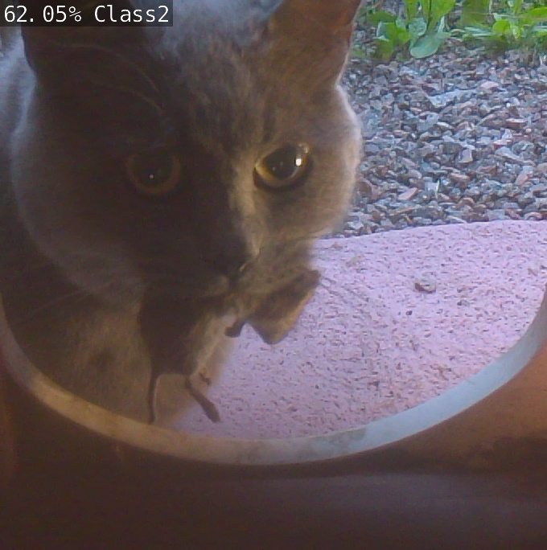
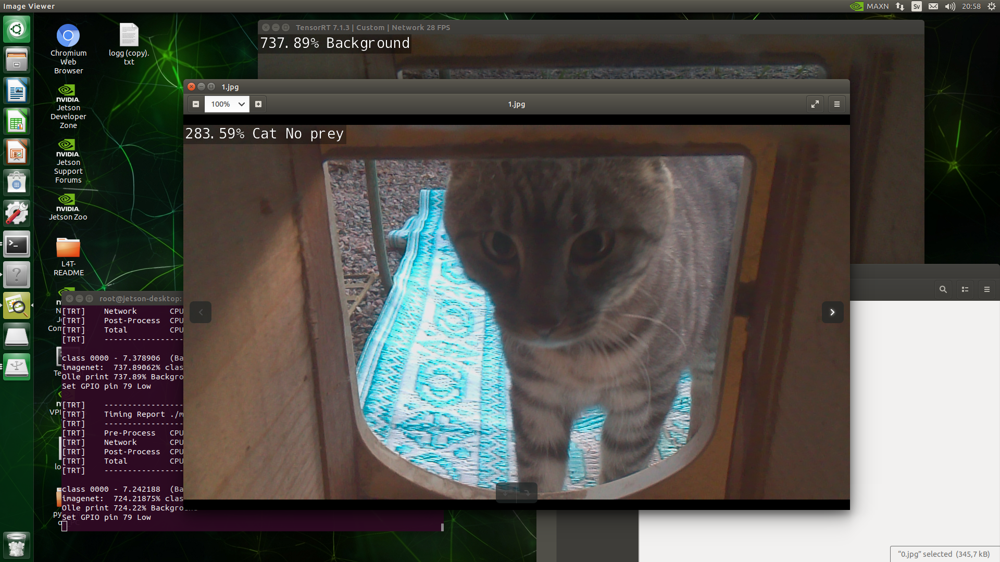
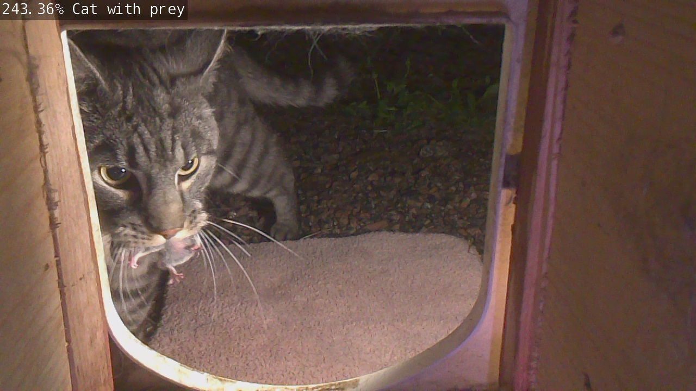
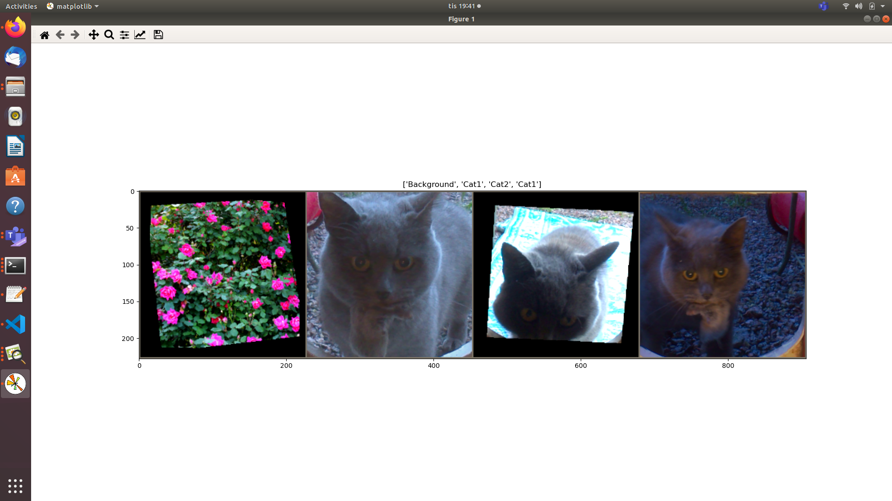
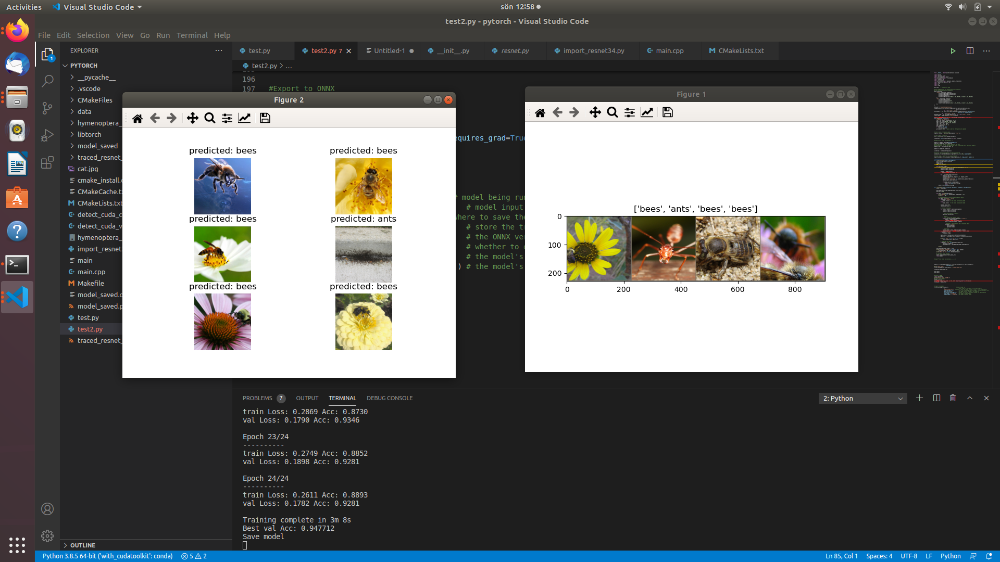
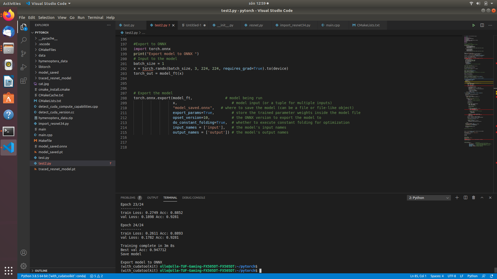
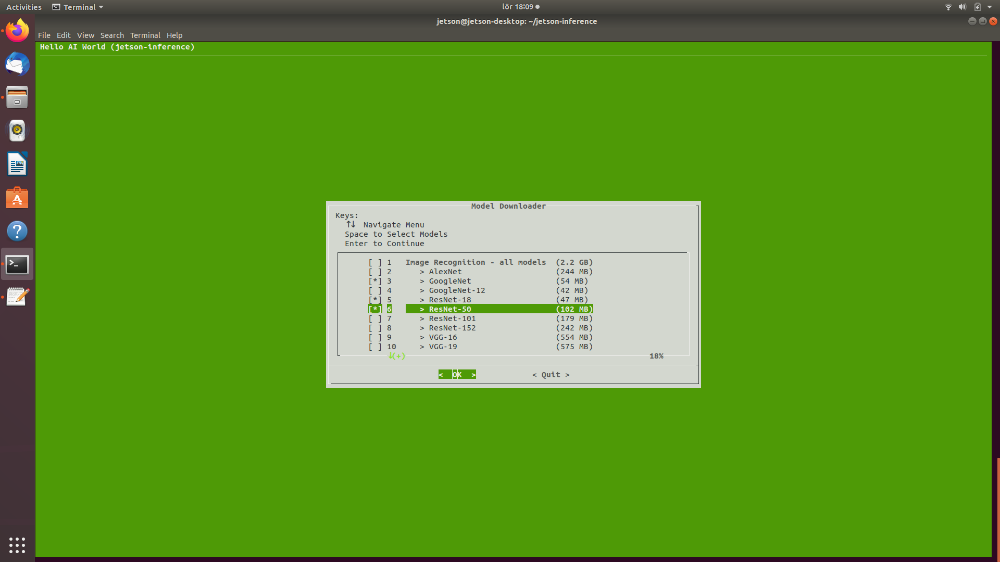
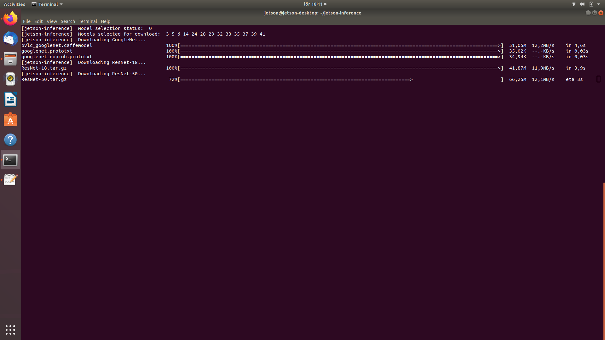
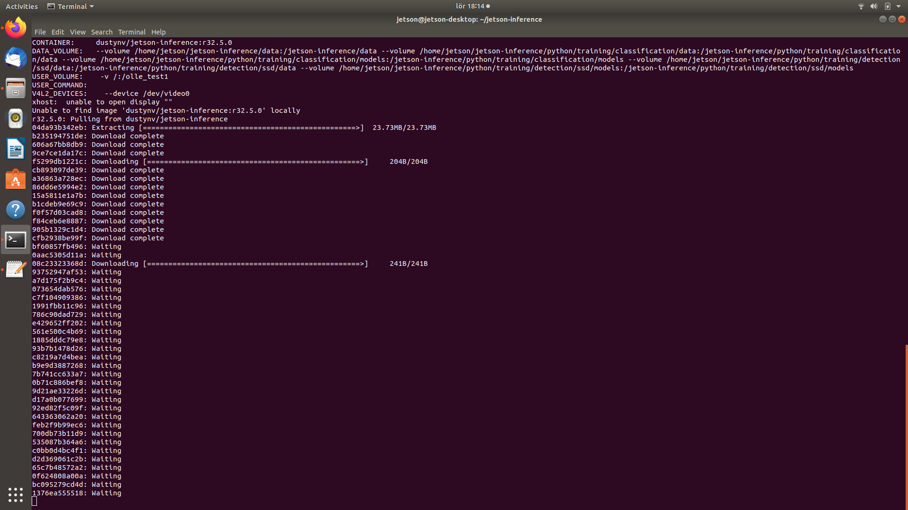
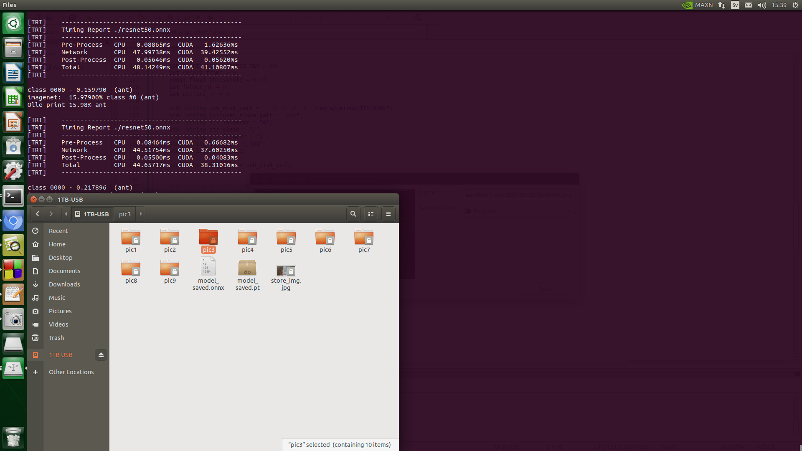

# PyTorch-Training-Resnet50. AUTO save cat (or other) images on external USB hard drive

### More examples 

Here with other texts in lable.txt
        
        class1   = Background
        class2   = Cat with prey
        class3   = Cat no prey

### Older examples with other scale factor on the probablility output text (more then 100 %)

        $ python load_test_export.py

## Related links

### Trainig on Ubuntu PC with or without GPU PyTorch

https://pytorch.org/tutorials/beginner/transfer_learning_tutorial.html

### Interferance on Jetson Nano

https://github.com/dusty-nv/jetson-inference

## Training and export to ONNX model on PC

### Number of class settings in train.py file
    
    ...
    # Here the size of each output sample is set to 3.
    # Alternatively, it can be generalized to nn.Linear(num_ftrs, len(class_names)).
    model_ft.fc = nn.Linear(num_ftrs, 3)  # change here number of classes
    ...

### Data Path structure

    $ ./data/hymenoptera_data/train/Background/imgXX.jpg
    $ ./data/hymenoptera_data/train/Cat1/imgXX.jpg
    $ ./data/hymenoptera_data/train/Cat2/imgXX.jpg
    $ ./data/hymenoptera_data/val/Background/imgXX.jpg
    $ ./data/hymenoptera_data/val/Cat1/imgXX.jpg
    $ ./data/hymenoptera_data/val/Cat2/imgXX.jpg

### Start train command

    $ ./python train.py

### Test result on PC test

Then close the two test windows to export to ONNX model

## Install Jetson Nano Device

Follow instructions from :
### Setting up Jetson with JetPack

https://github.com/dusty-nv/jetson-inference/blob/master/docs/jetpack-setup-2.md

#### Getting Started with Jetson Nano Developer Kit
https://developer.nvidia.com/embedded/learn/get-started-jetson-nano-devkit

Or

#### Getting Started with Jetson Nano 2GB Developer Kit
https://developer.nvidia.com/embedded/learn/get-started-jetson-nano-2gb-devkit

## Run on Jetson Nano

... to be continue .. not finnish yet

    imagenet2.cpp 
    
Will collect image if class 1 > thresshold probablility and store on external USB hard drive ..

### Start Docker container comand 

#### SSH from PC

    olle@olle-TUF-Gaming-FX505DT-FX505DT:~$ ssh jetson@192.168.xx.xx    
    
    jetson@jetson-desktop:~$ sudo apt-get update
    
    jetson@jetson-desktop:~$ git clone --recursive https://github.com/dusty-nv/jetson-inference
    
    jetson@jetson-desktop:~$ git clone https://github.com/ollewelin/PyTorch-Training-Resnet50
    
    jetson@jetson-desktop:~$ cp ~/PyTorch-Training-Resnet50/labels.txt ~/jetson-inference/examples/my-recognition
    
    jetson@jetson-desktop:~$ cp ~/PyTorch-Training-Resnet50/CMakeLists.txt ~/jetson-inference/examples/my-recognition
    
    jetson@jetson-desktop:~$ cp ~/PyTorch-Training-Resnet50/imagenet2.cpp ~/jetson-inference/examples/my-recognition

    jetson@jetson-desktop:~$ cd jetson-inference

    jetson@jetson-desktop:~/jetson-inference$ docker/run.sh --volume /:/olle_test1
    
  

    
    jetson@jetson-desktop:~/jetson-inference$ cd ../olle_test1/home/jetson/jetson-inference/examples/my-recognition

    root@jetson-desktop:/olle_test1/home/jetson/jetson-inference/examples/my-recognition# cmake CMakeLists.txt  
    -- The C compiler identification is GNU 7.5.0   
    -- The CXX compiler identification is GNU 7.5.0
    -- Check for working C compiler: /usr/bin/cc
    -- Check for working C compiler: /usr/bin/cc -- works
    -- Detecting C compiler ABI info
    -- Detecting C compiler ABI info - done
    -- Detecting C compile features
    -- Detecting C compile features - done
    -- Check for working CXX compiler: /usr/bin/c++
    -- Check for working CXX compiler: /usr/bin/c++ -- works
    -- Detecting CXX compiler ABI info
    -- Detecting CXX compiler ABI info - done
    -- Detecting CXX compile features
    -- Detecting CXX compile features - done
    -- Looking for pthread.h
    -- Looking for pthread.h - found
    -- Looking for pthread_create
    -- Looking for pthread_create - not found
    -- Looking for pthread_create in pthreads
    -- Looking for pthread_create in pthreads - not found
    -- Looking for pthread_create in pthread
    -- Looking for pthread_create in pthread - found
    -- Found Threads: TRUE  
    -- Found CUDA: /usr/local/cuda (found version "10.2") 
    -- Configuring done
    -- Generating done
    -- Build files have been written to: /olle_test1/home/jetson/jetson-inference/examples/my-recognition
    root@jetson-desktop:/olle_test1/home/jetson/jetson-inference/examples/my-recognition# make
    Scanning dependencies of target imagenet2
    [ 50%] Building CXX object CMakeFiles/imagenet2.dir/imagenet2.cpp.o
    [100%] Linking CXX executable imagenet2
    [100%] Built target imagenet2
    root@jetson-desktop:/olle_test1/home/jetson/jetson-inference/examples/my-recognition# 
    
### Copy over the Inference ONNX model

### Run program (first time TensorRT import the ONNX model)

    root@jetson-desktop:/olle_test1/home/jetson/jetson-inference/examples/my-recognition#./imagenet2 --model=./resnet50.onnx --input_blob=input --output_blob=output --labels=./labels.txt csi://0

### Auto save image on external USB disk

### Auto create image folder on external USB disk

