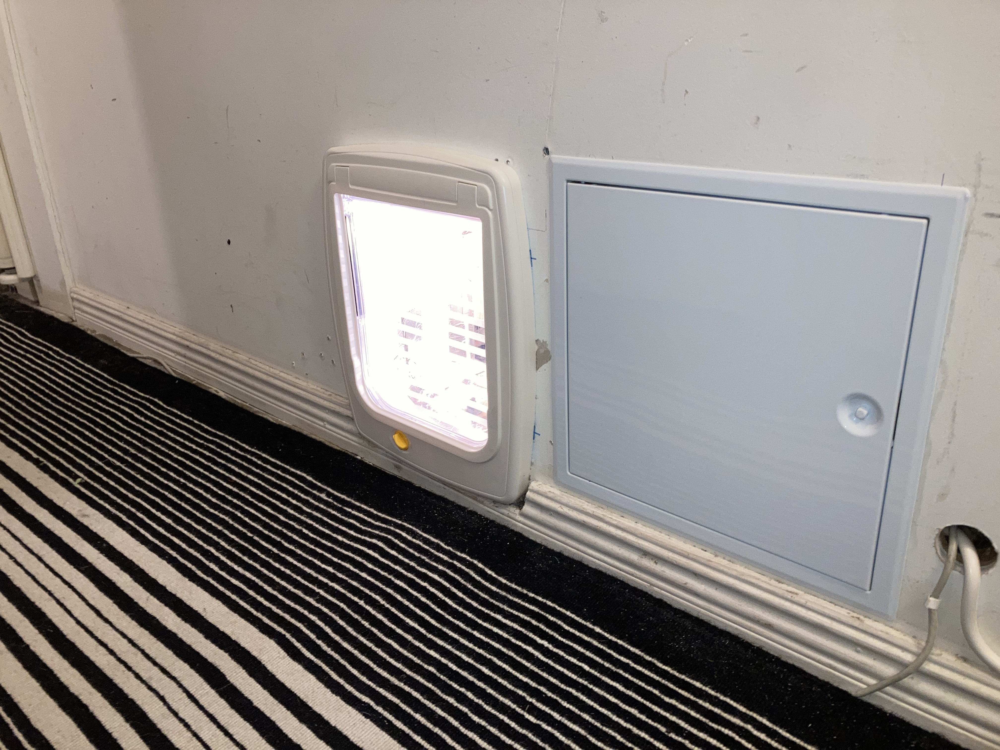

# PyTorch-Training-Resnet50. AUTO save cat (or other) images on external USB hard drive

Youtube Auto cat flap examples

https://www.youtube.com/watch?v=VDU2EMxDElc&t=34s

https://www.youtube.com/watch?v=emWBobbEPwY


### More examples 

Here with other texts in lable.txt
        
        class1   = Background
        class2   = Cat with prey
        class3   = Cat no prey


### New cat flap (updated 2022-04-24) Stereo view 3D input with a tunnel of mirrors.


### New installation




### Older examples with other scale factor on the probablility output text (more then 100 %)


        $ python load_test_export.py


## Related links

### Installation guide Anaconda for Trainig on Ubuntu PC

Only need to do the installation step 1 to 6

https://github.com/ollewelin/Installing-and-Test-PyTorch-C-API-on-Ubuntu-with-GPU-enabled


### Trainig on Ubuntu PC with or without GPU PyTorch

https://pytorch.org/tutorials/beginner/transfer_learning_tutorial.html

### Interferance on Jetson Nano

https://github.com/dusty-nv/jetson-inference


## Training and export to ONNX model on PC

### Number of class settings in train.py file
    
    ...
    # Here the size of each output sample is set to 3.
    # Alternatively, it can be generalized to nn.Linear(num_ftrs, len(class_names)).
    model_ft.fc = nn.Linear(num_ftrs, 3)  # change here number of classes
    ...

### Data Path structure

    $ ./data/hymenoptera_data/train/Background/imgXX.jpg
    $ ./data/hymenoptera_data/train/Cat1/imgXX.jpg
    $ ./data/hymenoptera_data/train/Cat2/imgXX.jpg
    $ ./data/hymenoptera_data/val/Background/imgXX.jpg
    $ ./data/hymenoptera_data/val/Cat1/imgXX.jpg
    $ ./data/hymenoptera_data/val/Cat2/imgXX.jpg

### Start train command

    $ python train.py

### Test result on PC test


Then close the two test windows to export to ONNX model


## Install Jetson Nano Device

Follow instructions from :
### Setting up Jetson with JetPack

https://github.com/dusty-nv/jetson-inference/blob/master/docs/jetpack-setup-2.md

#### Getting Started with Jetson Nano Developer Kit
https://developer.nvidia.com/embedded/learn/get-started-jetson-nano-devkit

Or

#### Getting Started with Jetson Nano 2GB Developer Kit
https://developer.nvidia.com/embedded/learn/get-started-jetson-nano-2gb-devkit


## Run on Jetson Nano

imagenet3.cpp 
    
Will collect image if class 1 > thresshold probablility and store on external USB hard drive ..

### Copy over the Cat with prey model

#### Combine splitted gz file on PC and convert to ONNX

#### Back on the PC, get the splitted model
        olle@olle-TUF-Gaming-FX505DT-FX505DT:~$
        $ git clone https://github.com/ollewelin/PyTorch-Training-Resnet50
        
##### Combine splitted files
        $ cd PyTorch-Training-Resnet50
        $ cat ./model_42/model_42_part_* > model_saved.pt

##### Split files
        $ split -b 20M model_saved.pt model_saved_part_
        
        
        
 #### Close windows..
 
        (base) olle@olle-TUF-Gaming-FX505DT-FX505DT:~/PyTorch-Training-Resnet50$ python load_test_export.py
        Hejvdsgdg
        Export model to ONNX 
        (base) olle@olle-TUF-Gaming-FX505DT-FX505DT:~/PyTorch-Training-Resnet50$ 
        
### Copy over the model to Jetson Nano over ethernet 

        $ cp model_saved.onnx model_31.onnx
        $ scp ~/PyTorch-Training-Resnet50/model_28.onnx jetson@192.168.<xxx>.<xxx>:~/jetson-inference/examples/my-recognition


### Start Docker container comand 

#### Check IP address on local network

```
        $ ifconfig
        $ arp -a
```

#### Check IP address at Jetson nano module

     jetson@jetson-desktop:~$ ip addr 
     
     192.168.1.<xxx>

#### SSH from PC

    olle@olle-TUF-Gaming-FX505DT-FX505DT:~$ ssh jetson@192.168.<xxx>.<xxx>    
    
    jetson@jetson-desktop:~$ sudo apt-get update
    
    jetson@jetson-desktop:~$ git clone --recursive https://github.com/dusty-nv/jetson-inference
    
    jetson@jetson-desktop:~$ git clone https://github.com/ollewelin/PyTorch-Training-Resnet50
    
    jetson@jetson-desktop:~$ cp ~/PyTorch-Training-Resnet50/labels.txt ~/jetson-inference/examples/my-recognition
    
    jetson@jetson-desktop:~$ cp ~/PyTorch-Training-Resnet50/CMakeLists.txt ~/jetson-inference/examples/my-recognition
    
    jetson@jetson-desktop:~$ cp ~/PyTorch-Training-Resnet50/imagenet2.cpp ~/jetson-inference/examples/my-recognition
    
    jetson@jetson-desktop:~$ cp ~/PyTorch-Training-Resnet50/imagenet3.cpp ~/jetson-inference/examples/my-recognition
    
    jetson@jetson-desktop:~$ cp ~/PyTorch-Training-Resnet50/start.sh ~/jetson-inference/examples/my-recognition

    jetson@jetson-desktop:~$ cd jetson-inference

    jetson@jetson-desktop:~/jetson-inference$ docker/run.sh --volume /:/olle_test1
    
  


    
    jetson@jetson-desktop:~/jetson-inference$ cd ../olle_test1/home/jetson/jetson-inference/examples/my-recognition

    root@jetson-desktop:/olle_test1/home/jetson/jetson-inference/examples/my-recognition# cmake CMakeLists.txt  
    -- The C compiler identification is GNU 7.5.0   
    -- The CXX compiler identification is GNU 7.5.0
    -- Check for working C compiler: /usr/bin/cc
    -- Check for working C compiler: /usr/bin/cc -- works
    -- Detecting C compiler ABI info
    -- Detecting C compiler ABI info - done
    -- Detecting C compile features
    -- Detecting C compile features - done
    -- Check for working CXX compiler: /usr/bin/c++
    -- Check for working CXX compiler: /usr/bin/c++ -- works
    -- Detecting CXX compiler ABI info
    -- Detecting CXX compiler ABI info - done
    -- Detecting CXX compile features
    -- Detecting CXX compile features - done
    -- Looking for pthread.h
    -- Looking for pthread.h - found
    -- Looking for pthread_create
    -- Looking for pthread_create - not found
    -- Looking for pthread_create in pthreads
    -- Looking for pthread_create in pthreads - not found
    -- Looking for pthread_create in pthread
    -- Looking for pthread_create in pthread - found
    -- Found Threads: TRUE  
    -- Found CUDA: /usr/local/cuda (found version "10.2") 
    -- Configuring done
    -- Generating done
    -- Build files have been written to: /olle_test1/home/jetson/jetson-inference/examples/my-recognition
    root@jetson-desktop:/olle_test1/home/jetson/jetson-inference/examples/my-recognition# make
    Scanning dependencies of target imagenet2
    [ 50%] Building CXX object CMakeFiles/imagenet2.dir/imagenet2.cpp.o
    [100%] Linking CXX executable imagenet2
    [100%] Built target imagenet2
    root@jetson-desktop:/olle_test1/home/jetson/jetson-inference/examples/my-recognition# 

### Or start docker with a start.sh script inside container

        $ cd jetson-inference

        $ docker/run.sh --volume /:/olle_test1 -r "bash ../olle_test1/home/jetson/jetson-inference/examples/my-recognition/start.sh"
        
 Or all from bash start_script.sh 
 
        $ cd jetson-inference
 
        $ ~/jetson-inference/bash start_script.sh      


### Run program (first time TensorRT import the ONNX model) Start On Jetson Target

Cat example model_31.onnx

       $ root@jetson-desktop:/olle_test1/home/jetson/jetson-inference/examples/my-recognition#./imagenet2 --model=./model_31.onnx --input_blob=input --output_blob=output --labels=./labels.txt csi://0

Or less printout's and other thresshold Cat with prey

        $ ./imagenet3 --model=./model_31.onnx --input_blob=input --output_blob=output --labels=./labels.txt csi://0

Or first example 

    root@jetson-desktop:/olle_test1/home/jetson/jetson-inference/examples/my-recognition#./imagenet2 --model=./resnet50.onnx --input_blob=input --output_blob=output --labels=./labels.txt csi://0

### Auto save image on external USB disk


### Auto create image folder on external USB disk


# Jetson Nano build from Source and auto start

## Build from source (Instead of using Docker)

Jetson nano Build from source

https://github.com/dusty-nv/jetson-inference/blob/master/docs/building-repo-2.md

```
$ sudo apt-get update
$ sudo apt-get install git cmake libpython3-dev python3-numpy
$ git clone --recursive https://github.com/dusty-nv/jetson-inference
$ cd jetson-inference
$ mkdir build
$ cd build
$ cmake ../
$ make -j$(nproc)
$ sudo make install
$ sudo ldconfig
```

## Start Jetson Nano directly after boot

### Enable Auto login Jetson Nano module

Run the “User Accounts” app, then click the “Unlock” button in the top right of the window and enter your sudo password, and then you can enable/disable Automatic Login for your account.

### Edit bash_completion.sh with inside Vim editor from PC SSH

SSH From PC side
```
ssh jetson@192.168.1.xxx
sudo vim ~/../../etc/profile.d/bash_completion.sh
```
### Add start_d.sh script at bash_completion.sh with inside Vim editor 
Vim guide

https://coderwall.com/p/adv71w/basic-vim-commands-for-getting-started

#### Edit Commands
R - to replace more than one character

```
R
```
#### Add line directly from Source (Not Docker) With streaming to explicitly IP number on LAN
```
bash ~/jetson-inference/examples/my-recognition/start_rtp.sh
```

#### Or line Docker use
```
bash ~/jetson-inference/start_script.sh
```


#### Save, Exit and reboot Jetson Nano
:wq - to save and exit
```
press ESC to set VIM to command mode

:wq

sudo reboot
```

#### Install gstreamer on PC Ubuntu
https://gstreamer.freedesktop.org/documentation/installing/on-linux.html?gi-language=c
```
sudo apt-get update
sudo apt-get install libgstreamer1.0-dev libgstreamer-plugins-base1.0-dev libgstreamer-plugins-bad1.0-dev gstreamer1.0-plugins-base gstreamer1.0-plugins-good gstreamer1.0-plugins-bad gstreamer1.0-plugins-ugly gstreamer1.0-libav gstreamer1.0-doc gstreamer1.0-tools gstreamer1.0-x gstreamer1.0-alsa gstreamer1.0-gl gstreamer1.0-gtk3 gstreamer1.0-qt5 gstreamer1.0-pulseaudio
```
#### Start gstreamer video view on PC 
```
gst-launch-1.0 -v udpsrc port=1234  caps = "application/x-rtp, media=(string)video, clock-rate=(int)90000, encoding-name=(string)H264, payload=(int)96" !  rtph264depay ! decodebin ! videoconvert ! autovideosink
```
#### Auto restart jetson-nano application ever day at 12:00
```
crontab -e
0 12 * * * /home/jetson/jetson-inference/examples/my-recognition/restart_app.sh
crontab -l
chmod +x /home/jetson/jetson-inference/examples/my-recognition/restart_app.sh
sudo service cron start
sudo service cron restart
grep CRON /var/log/syslog

```

### Set up Jetson nano Headless mode without HDMI display attached

```
sudo apt-get install usbmount
sudo reboot
lsusb
sudo mount /dev/sdX1 /mnt
```

### Step 1: Create a udev Rule
#### Find the UUID of your USB stick:
#### Run the following command to get the UUID:

```
sudo blkid
sudo nano /etc/udev/rules.d/99-usb-mount.rules
sudo nano /etc/fstab
"ADD line"
UUID=UUID /media/jetson/USB1-8GB auto defaults,nofail 0 0
sudo mkdir -p /media/jetson/USB1-8GB
sudo reboot
```

#### Check that /media/jetson/USB1-8GB exist without HDMI display

```
ls /media/jetson/USB1-8GB
```

